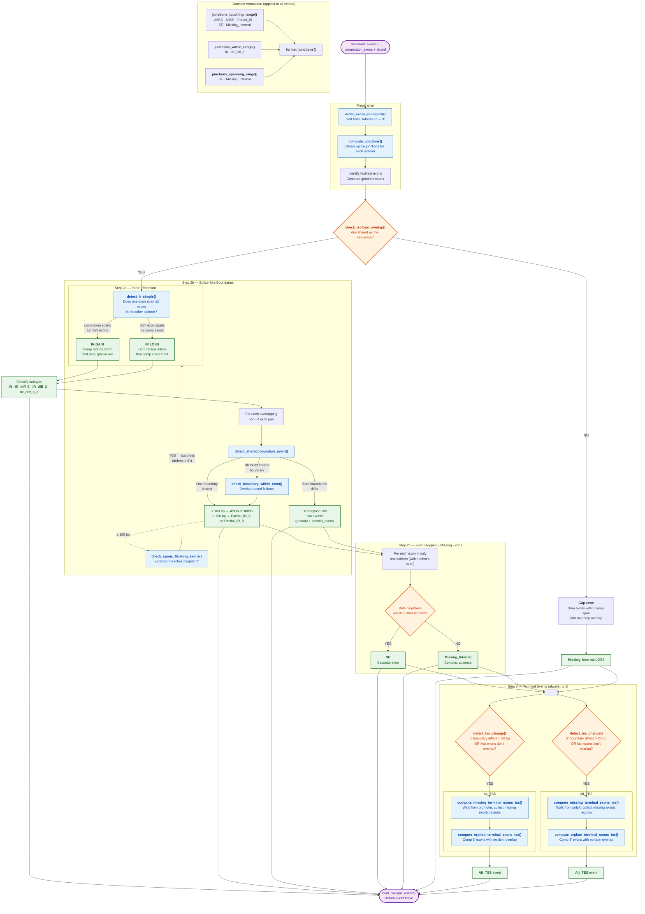

# Event Detection Data Flow

Rendered automatically by GitHub and most Markdown editors that support Mermaid.

```mermaid
flowchart TD
    INPUT(["dominant_exons + comparator_exons + strand"])
    INPUT --> ORDER

    %% ── Preparation ──────────────────────────────────────────
    subgraph PREP ["Preparation"]
        ORDER["<b>order_exons_biological()</b><br/>Sort both isoforms 5′ → 3′"]
        JUNC["<b>compute_junctions()</b><br/>Derive splice junctions for each isoform"]
        BOUND["Identify first/last exons<br/>Compute genomic spans"]
        ORDER --> JUNC --> BOUND
    end

    BOUND --> OVERLAP

    %% ── Overlap Guard ────────────────────────────────────────
    OVERLAP{"<b>check_isoform_overlap()</b><br/>Any shared exonic sequence?"}

    OVERLAP -- "YES" --> IR_DET
    OVERLAP -- "NO" --> GAP

    %% ── Step 2a: Intron Retention ────────────────────────────
    subgraph S2A ["Step 2a — Intron Retention"]
        IR_DET["<b>detect_ir_simple()</b><br/>Does one exon span ≥2 exons<br/>in the other isoform?"]

        IR_GAIN["<b>IR GAIN</b><br/>Comp retains intron<br/>that dom spliced out"]
        IR_LOSS["<b>IR LOSS</b><br/>Dom retains intron<br/>that comp spliced out"]

        IR_DET -- "comp exon spans<br/>≥2 dom exons" --> IR_GAIN
        IR_DET -- "dom exon spans<br/>≥2 comp exons" --> IR_LOSS
    end

    IR_GAIN --> IR_CLASS["Classify subtype:<br/><b>IR</b> · <b>IR_diff_5</b> · <b>IR_diff_3</b> · <b>IR_diff_5_3</b>"]
    IR_LOSS --> IR_CLASS

    %% ── Step 2b: Splice-Site Boundaries ──────────────────────
    IR_CLASS --> PAIRS
    subgraph S2B ["Step 2b — Splice-Site Boundaries"]
        PAIRS["For each overlapping<br/>non-IR exon pair"]
        SHARED["<b>detect_shared_boundary_event()</b>"]
        PAIRS --> SHARED

        SHARED -- "One boundary<br/>shared" --> CLASSIFY_ONE
        SHARED -- "Both boundaries<br/>differ" --> CLASSIFY_DUAL
        SHARED -- "No exact shared<br/>boundary" --> FALLBACK

        CLASSIFY_ONE["< 100 bp → <b>A5SS</b> or <b>A3SS</b><br/>≥ 100 bp → <b>Partial_IR_5</b> or <b>Partial_IR_3</b>"]
        FLANKING["<b>check_spans_flanking_exons()</b><br/>Extension reaches neighbor?"]
        CLASSIFY_ONE -. "≥ 100 bp" .-> FLANKING
        FLANKING -- "YES → suppress<br/>(defers to IR)" --> S2A

        CLASSIFY_DUAL["Decompose into<br/>two events<br/>(primary + second_event)"]

        FALLBACK["<b>check_boundary_within_exon()</b><br/>Overlap-based fallback"]
        FALLBACK --> CLASSIFY_ONE
    end

    %% ── Step 2c: Exon Skipping ───────────────────────────────
    CLASSIFY_ONE --> SE_DET
    CLASSIFY_DUAL --> SE_DET
    subgraph S2C ["Step 2c — Exon Skipping / Missing Exons"]
        SE_DET["For each exon in only<br/>one isoform (within other's span)"]
        FLANK_CHK{"Both neighbors<br/>overlap other isoform?"}
        SE_DET --> FLANK_CHK
        FLANK_CHK -- "YES" --> SE_EVT["<b>SE</b><br/>Cassette exon"]
        FLANK_CHK -- "NO" --> MI_EVT["<b>Missing_Internal</b><br/>Complex absence"]
    end

    %% ── Gap Zone (non-overlapping isoforms) ──────────────────
    GAP["<b>Gap zone</b><br/>Dom exons within comp span<br/>with no comp overlap"]
    GAP --> MI_GAP["<b>Missing_Internal</b> LOSS"]

    %% ── Step 3: Terminal Events ──────────────────────────────
    SE_EVT --> TERM
    MI_EVT --> TERM
    MI_GAP --> TERM

    subgraph S3 ["Step 3 — Terminal Events (always runs)"]
        TERM[" "]

        TSS{"<b>detect_tss_change()</b><br/>5′ boundary differs > 20 bp<br/>OR first exons don't overlap?"}
        TES{"<b>detect_tes_change()</b><br/>3′ boundary differs > 20 bp<br/>OR last exons don't overlap?"}

        TERM --> TSS
        TERM --> TES

        TSS -- "YES" --> TSS_COMP
        TES -- "YES" --> TES_COMP

        subgraph TSS_BOX ["Alt_TSS"]
            TSS_COMP["<b>compute_missing_terminal_exons_tss()</b><br/>Walk from promoter, collect missing exonic regions"]
            TSS_ORPH["<b>compute_orphan_terminal_exons_tss()</b><br/>Comp 5′ exons with no dom overlap"]
            TSS_COMP --> TSS_ORPH
        end

        subgraph TES_BOX ["Alt_TES"]
            TES_COMP["<b>compute_missing_terminal_exons_tes()</b><br/>Walk from polyA, collect missing exonic regions"]
            TES_ORPH["<b>compute_orphan_terminal_exons_tes()</b><br/>Comp 3′ exons with no dom overlap"]
            TES_COMP --> TES_ORPH
        end
    end

    TSS_ORPH --> ALT_TSS_OUT["<b>Alt_TSS</b> event"]
    TES_ORPH --> ALT_TES_OUT["<b>Alt_TES</b> event"]

    %% ── Junction Annotation (parallel track) ─────────────────
    subgraph JTRACK ["Junction Annotation (applied to all events)"]
        direction LR
        JT["<b>junctions_touching_range()</b><br/>A5SS · A3SS · Partial_IR · SE · Missing_Internal"]
        JW["<b>junctions_within_range()</b><br/>IR · IR_diff_*"]
        JS["<b>junctions_spanning_range()</b><br/>SE · Missing_Internal"]
        FMT["<b>format_junctions()</b>"]
        JT --> FMT
        JW --> FMT
        JS --> FMT
    end

    %% ── Output ───────────────────────────────────────────────
    IR_CLASS --> OUTPUT
    CLASSIFY_ONE --> OUTPUT
    CLASSIFY_DUAL --> OUTPUT
    SE_EVT --> OUTPUT
    MI_EVT --> OUTPUT
    MI_GAP --> OUTPUT
    ALT_TSS_OUT --> OUTPUT
    ALT_TES_OUT --> OUTPUT

    OUTPUT(["bind_rows(all_events)<br/>Return event tibble"])

    %% ── Styling ──────────────────────────────────────────────
    classDef event fill:#e8f5e9,stroke:#2e7d32,stroke-width:2px,color:#1b5e20
    classDef guard fill:#fff3e0,stroke:#e65100,stroke-width:2px,color:#bf360c
    classDef func fill:#e3f2fd,stroke:#1565c0,stroke-width:1px,color:#0d47a1
    classDef io fill:#f3e5f5,stroke:#6a1b9a,stroke-width:2px,color:#4a148c

    class IR_GAIN,IR_LOSS,SE_EVT,MI_EVT,MI_GAP,ALT_TSS_OUT,ALT_TES_OUT,IR_CLASS,CLASSIFY_ONE,CLASSIFY_DUAL event
    class OVERLAP,FLANK_CHK,TSS,TES guard
    class ORDER,JUNC,SHARED,IR_DET,FLANKING,FALLBACK,TSS_COMP,TSS_ORPH,TES_COMP,TES_ORPH func
    class INPUT,OUTPUT io
```
